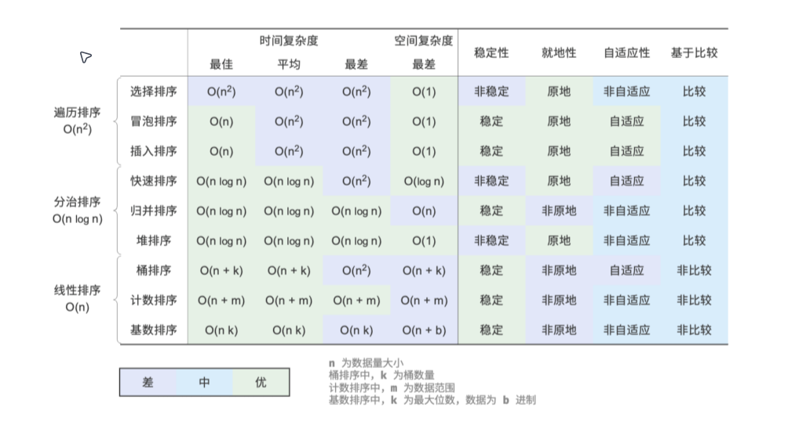

# Cpp 2024 春季招聘面试笔记

This is the repository I use to keep track of spring 2024 recruiting (c++)

这是我用于记录 2024 春招(c++)的仓库

- [Cpp 2024 春季招聘面试笔记](#cpp-2024-春季招聘面试笔记)
    - [计算机基础](#计算机基础)
      - [原码 反码 补码](#原码-反码-补码)
      - [大端 vs 小端](#大端-vs-小端)
    - [C 语言](#c-语言)
      - [函数参数入栈顺序及 i++,++i 实现](#函数参数入栈顺序及-ii-实现)
      - [函数指针 \&\& 函数指针数组 \&\& 指向函数指针数组的指针](#函数指针--函数指针数组--指向函数指针数组的指针)
      - [隐式类型转换法则](#隐式类型转换法则)
      - [设置、清除、切换和检查单个位](#设置清除切换和检查单个位)
      - [空指针 \&\& 野指针](#空指针--野指针)
    - [C++](#c)
      - [STL](#stl)
      - [自定义函数比较器](#自定义函数比较器)
    - [算法](#算法)
      - [排序算法](#排序算法)
      - [单调队列](#单调队列)
      - [单调栈](#单调栈)
    - [数据库](#数据库)
    - [系统编程](#系统编程)
    - [网络编程](#网络编程)

### 计算机基础

---

#### 原码 反码 补码

##### 原码

原码，符号位加真值的绝对值

```
+3[原] = 00000011
-3[原] = 10000011
```

##### 反码

正数的反码是其原码

负数的反码，符号位不变，其余各位`~`(取反)

```
+3[反] = 00000011[原] = 00000011[反]
-3[反] = 10000011[原] = 11111100[反]
```

##### 补码

正数的补码是其原码

负数的补码，是其反码+1

```
+3[补] = 00000011[原] = 00000011[反] = 00000011[补]
-3[补] = 00000011[原] = 11111100[反] = 11111101[补]
```

反码和补码，不能直接看出其实际的数值， 需要转换成原码后计算

数据在内存中均以补码形式存储，方便计算(做加法无需考虑符号)

#### 大端 vs 小端

##### 什么是字节序

字节顺序，又称端序或尾序（英语：Endianness），在计算机科学领域中，指电脑内存中或在数字通信链路中，组成多字节的字的字节的排列顺序。

在几乎所有的机器上，多字节对象都被存储为连续的字节序列。例如在 C 语言中，一个类型为 int 的变量 x 地址为 0x100，那么其对应地址表达式&x 的值为 0x100。且 x 的四个字节将被存储在电脑内存的 0x100, 0x101, 0x102, 0x103 位置。

字节的排列方式有两个通用规则。例如，将一个多位数的低位放在较小的地址处，高位放在较大的地址处，则称小端序；反之则称大端序。在网络应用中，字节序是一个必须被考虑的因素，因为不同机器类型可能采用不同标准的字节序，所以均按照网络标准转化。

例如假设上述变量 x 类型为 int，位于地址 0x100 处，它的值为 0x01234567，地址范围为 0x100~0x103 字节，其内部排列顺序依赖于机器的类型。大端法从首位开始将是：0x100: 0x01, 0x101: 0x23,..。而小端法将是：0x100: 0x67, 0x101: 0x45,..。

##### 大端序


低位高地址

##### 小端序


低位低地址

> tips: 为了保证传送顺序的一致性, 网际协议使用大端字节序来传送数据。

**参考**

[维基百科-字节序](https://zh.wikipedia.org/zh-cn/%E5%AD%97%E8%8A%82%E5%BA%8F)

### C 语言

---

#### 函数参数入栈顺序及 i++,++i 实现

i++

```c
// i++
int j = i;
i = i + 1;
return j;
```

++i

```c
// ++i
i = i + 1;
return i;
```

```c
int i = 0;
printf("%d %d %d %d\n", ++i, i++, i++, ++i); // 4 2 1 4
```

#### 函数指针 && 函数指针数组 && 指向函数指针数组的指针

##### 函数指针

本质上是一个指针，指向一个函数

- 定义函数指针

`void (*fp)(int a, int b);`

函数指针是专用的，格式要求很强，返回值、参数类型、参数个数都必须相同

- 如何给函数指针赋值

```c
void f(int a, int b) {

}

void (*fp)(int a, int b) = data;
```

- 如何调用函数指针

```c
p2(a, b);
(*p2)(a, b);
```

##### 函数指针数组

声明一个数组，里面存储的类型是指向函数的指针

```c
int ret;

int *add(int a, int b) {
    ret = a + b;
    return &ret;
}

int main(int argc, char*argv[]) {

    int a = 10;
    int b = 20;

    int *p = add(a, b);

    printf("%d\n", *p);

    return 0;
}

```

##### 函数指针数组

```c
int Add(int x, int y) {
    return x + y;
}

int Sub(int x, int y) {
    return x - y;
}

int MUl(int x, int y) {
    return x * y;
}

int Div(int x, int y) {
    return x / y;
}

int main(int argc, char*argv[]) {

    int (*pf1)(int, int) = Add;
    int (*pf2)(int, int) = Sub;
    int (*pf3)(int, int) = Mul;
    int (*pf4)(int, int) = Div;

    // 函数指针数组
    int (*pf[4])(int, int) = {Add, Sub, Mul, Div};

    // 调用

    for (int i = 0;i < 4; i++) {
        pf[i](2, 5);
    }
}

```

#### 隐式类型转换法则

若参与运算的数据类型相同则运算所得结果的数据类型也为该数据类型。若参与运算的数据类型不同，则先转换成同一类型，然后进行运算。

1. 转化按数据长度增加的方向进行，以保证精度不降低。例如 int 类型和 long 类型运算时，先把 int 类型转换成 long 类型后再进行运算
2. 即当参加算数或比较运算的两个操作数类型不统一时，将简单类型向复杂类型转换

$$char->short->int->long->float->double$$

3. 在赋值语句中，赋值号两边数据类型一定是相兼容的类型，如果等号两边数据类型不兼容，语句在编译时会报错

#### 设置、清除、切换和检查单个位

设置第 N 位：`Number |= (1ul << nth Position)`

设置第 N 位意味着如果第 N 位为 0，则将其设置为 1，如果为 1，则保持不变。在 C 中，按为或运算用于设置整数数据类型的位。据我们所知 | 计算一个新的整数值，其中每个位的位置只有当操作数(数据类型)在该位置为 1 时才为 1。

简而言之，如果其中任何一位为 1，则可以说两位的按位与始终为 1

0 | 0 = 0  
1 | 0 = 1  
0 | 1 = 1  
1 | 1 = 1

清除位：`Number &= ~(1UL << nth Position)`

清除位意味着如果第 N 位为 1，则将其清为 0，如果为 0，则保持不变。按位与运算符用于清除位整数数据类型。如果其中任何一位为零，则两位的“与”始终为零。

0 & 0 = 0  
1 & 0 = 0  
0 & 1 = 1

检查位:`Bit = Number & (1UL << nth Position)`

要检查第 n 位，先将第 n 个“1” 位置向左移动，然后将其与数字“与”

切换位：`Numebr ^ = (1UL << nth Position)`

切换位表示如果第 N 位为 1，则将其更改为 0， 如果为 0， 则将其更改为 1。按位异或运算符用于切换整数数据类型的位。要切换第 n 个位移位，将第 n 个位置的'1'向左移动并异或它

0 ^ 0 = 1  
1 ^ 0 = 1  
0 ^ 1 = 0  
1 ^ 1 = 1

#### 空指针 && 野指针

##### 空指针

指向地址 0 的指针

C 语言中

```c
#define NULL ((void *)0) // msvc
int *p = NULL;
```

C++

```cpp
#define NULL 0 // msvc
```

C++11 中加入`nullptr`

NULL 与 nullptr 比较

```cpp
void func(int n);
void func(char *s);

func( NULL );
```

使用如上的函数重载时，在调用`func( NULL )`时，我们期望`void func(char *s);`被调用，而实际上`NULL`被解释为 0，因此编译器将调用`void func(int n);`

在 C++11 中，nullptr 是一个新关键字，可以（并且应该！）用于表示 NULL 指针；

**Notice:**

> 空指针不能被解引用，类似`int *p = NULL; *p = 2;`的语句会引起编译错误

##### 野指针

定义：

> 一个指针既不引用合法对象，也不为 NULL

产生野指针(wild pointer)的原因

- 未初始化的指针对象
- 已不存在的对象
- 计算的指针值
- 不正确对齐的指针值
- 指针本身或其指向内容的意外损坏
- ...

```c
int main(void)
{

   int *p;  // uninitialized and non-static;  value undefined 未初始化且非static 值未定义
   {
      int i1;
      p = &i1;  // valid 有效的
   }            // i1 no longer exists;  p now invalid    i1不再存在 p现在无效

   p = (int*)0xABCDEF01;  // very likely not the address of a real object 很可能不是真实存在的对象地址

   {
      int i2;
      p = (int*)(((char*)&i2) + 1);  // p very likely to not be aligned for int access p很可能未针对 int 访问进行对齐
   }

   {
      char *oops = (char*)&p;
      oops[0] = 'f';  oops[1] = 35;  // p was clobbered p被破坏
   }
}
```

**参考**

[stack overflow \`What is the meaning of "wild pointer" in C?\` 高分回答](https://stackoverflow.com/a/2584552)

### C++

---

#### STL

- container
  - [vector](#vector)
  - [unordered_set](#unordered_set)
- Algorithms
- iterators


C++ STL（标准模板库）是一套功能强大的 C++ 模板类，提供了通用的模板类和函数，这些模板类和函数可以实现多种流行和常用的算法和数据结构，如向量、链表、队列、栈。

C++ 标准模板库的核心包括以下三个组件：

| 组件               | 描述                                                                                             |
| ------------------ | ------------------------------------------------------------------------------------------------ |
| 容器（Containers） | 容器是用来管理某一类对象的集合。C++ 提供了各种不同类型的容器，比如 deque、list、vector、map 等。 |
| 算法（Algorithms） | 算法作用于容器。它们提供了执行各种操作的方式，包括对容器内容执行初始化、排序、搜索和转换等操作。 |
| 迭代器（iterators） | 迭代器用于遍历对象集合的元素。这些集合可能是容器，也可能是容器的子集。 |

[菜鸟教程](https://www.runoob.com/cplusplus/cpp-stl-tutorial.html)

##### vector

`vector`与动态数组相同，能够在插入或删除元素时自动调整自身大小，其存储由容器自动处理。`vector`元素被放置在连续的内存中，以便可以使用迭代器访问和遍历它们。在`vector`中，数据插入到末尾。在末尾插入需要不同的时间，因为有时可能需要扩展数组。删除最后一个元素只需要$O(1)$时间，因为不会发生大小调整。在开头或中间插入和擦除在时间上是线性的。

**Syntax**

```cpp
std::vector<dataType> vectorName;
```

常用函数

- `begin()`、`end()`
- `size()`、`capacity()`、`empty()`
- `at(g)`、`front()`、`back()`
- `push_back()`、`pop_back()`、`clear()`、`earse()`、`emplace()`、`emplace_back()`

Example:

```cpp
// C++ program to illustrate the 
// Modifiers in vector 
#include <bits/stdc++.h> 
#include <vector> 
using namespace std; 
  
int main() 
{ 
    // Assign vector 
    vector<int> v; 
  
    // fill the vector with 10 five times 
    v.assign(5, 10); 
  
    cout << "The vector elements are: "; 
    for (int i = 0; i < v.size(); i++) 
        cout << v[i] << " "; 
  
    // inserts 15 to the last position 
    v.push_back(15); 
    int n = v.size(); 
    cout << "\nThe last element is: " << v[n - 1]; 
  
    // removes last element 
    v.pop_back(); 
  
    // prints the vector 
    cout << "\nThe vector elements are: "; 
    for (int i = 0; i < v.size(); i++) 
        cout << v[i] << " "; 
  
    // inserts 5 at the beginning 
    v.insert(v.begin(), 5); 
  
    cout << "\nThe first element is: " << v[0]; 
  
    // removes the first element 
    v.erase(v.begin()); 
  
    cout << "\nThe first element is: " << v[0]; 
  
    // inserts at the beginning 
    v.emplace(v.begin(), 5); 
    cout << "\nThe first element is: " << v[0]; 
  
    // Inserts 20 at the end 
    v.emplace_back(20); 
    n = v.size(); 
    cout << "\nThe last element is: " << v[n - 1]; 
  
    // erases the vector 
    v.clear(); 
    cout << "\nVector size after clear(): " << v.size(); 
  
    // two vector to perform swap 
    vector<int> v1, v2; 
    v1.push_back(1); 
    v1.push_back(2); 
    v2.push_back(3); 
    v2.push_back(4); 
  
    cout << "\n\nVector 1: "; 
    for (int i = 0; i < v1.size(); i++) 
        cout << v1[i] << " "; 
  
    cout << "\nVector 2: "; 
    for (int i = 0; i < v2.size(); i++) 
        cout << v2[i] << " "; 
  
    // Swaps v1 and v2 
    v1.swap(v2); 
  
    cout << "\nAfter Swap \nVector 1: "; 
    for (int i = 0; i < v1.size(); i++) 
        cout << v1[i] << " "; 
  
    cout << "\nVector 2: "; 
    for (int i = 0; i < v2.size(); i++) 
        cout << v2[i] << " "; 
} 
```

Output

```
The vector elements are: 10 10 10 10 10 
The last element is: 15
The vector elements are: 10 10 10 10 10 
The first element is: 5
The first element is: 10
The first element is: 5
The last element is: 20
Vector size after erase(): 0

Vector 1: 1 2 
Vector 2: 3 4 
After Swap 
Vector 1: 3 4 
Vector 2: 1 2
```

##### set

`set`是一种关联容器，其中每个元素都必须是唯一的，因为元素的值可以标识它。这些值以特定的排序顺序存储，即升序或降序。

使用二叉搜索树实现

**Syntax**

```cpp
std::set <data_type> set_name;
```

常用函数

* `begin()`
* `end()`
* `size()`
* `max_size()`
* `empty()`

Example:

```cpp
// C++ program to demonstrate various functions of
// STL
#include <iostream>
#include <iterator>
#include <set>
using namespace std;

int main()
{
	// empty set container
	set<int, greater<int> > s1;

	// insert elements in random order
	s1.insert(40);
	s1.insert(30);
	s1.insert(60);
	s1.insert(20);
	s1.insert(50);

	// only one 50 will be added to the set
	s1.insert(50);
	s1.insert(10);

	// printing set s1
	set<int, greater<int> >::iterator itr;
	cout << "\nThe set s1 is : \n";
	for (itr = s1.begin(); itr != s1.end(); itr++) {
		cout << *itr << " ";
	}
	cout << endl;

	// assigning the elements from s1 to s2
	set<int> s2(s1.begin(), s1.end());

	// print all elements of the set s2
	cout << "\nThe set s2 after assign from s1 is : \n";
	for (itr = s2.begin(); itr != s2.end(); itr++) {
		cout << *itr << " ";
	}
	cout << endl;

	// remove all elements up to 30 in s2
	cout << "\ns2 after removal of elements less than 30 "
			":\n";
	s2.erase(s2.begin(), s2.find(30));
	for (itr = s2.begin(); itr != s2.end(); itr++) {
		cout << *itr << " ";
	}

	// remove element with value 50 in s2
	int num;
	num = s2.erase(50);
	cout << "\ns2.erase(50) : ";
	cout << num << " removed\n";
	for (itr = s2.begin(); itr != s2.end(); itr++) {
		cout << *itr << " ";
	}

	cout << endl;

	// lower bound and upper bound for set s1
	cout << "s1.lower_bound(40) : "
		<< *s1.lower_bound(40) << endl;
	cout << "s1.upper_bound(40) : "
		<< *s1.upper_bound(40) << endl;

	// lower bound and upper bound for set s2
	cout << "s2.lower_bound(40) : "
		<< *s2.lower_bound(40) << endl;
	cout << "s2.upper_bound(40) : "
		<< *s2.upper_bound(40) << endl;

	return 0;
}

```

Output

```
The set s1 is : 
60 50 40 30 20 10 

The set s2 after assign from s1 is : 
10 20 30 40 50 60 

s2 after removal of elements less than 30 :
30 40 50 60 
s2.erase(50) : 1 removed
30 40 60 
s1.lower_bound(40) : 40
s1.upper_bound(40) : 30
s2.lower_bound(40) : 40
s2.upper_bound(40) : 60
```

##### unordered_set

`unordered_set`是使用哈希表实现的无序关联容器，其键被哈希到哈希表的索引中，以便插入始终是随机的。`unordered_set`上的所有操作平均需要常数时间 O(1)，在最坏的情况下可以达到线性时间 O(n)，这取决于内部使用的哈希函数，但实际上它们执行得非常好并且通常提供常数时间查找操作。

**Syntax**

```cpp
std::unordered_set<data_type> name;
```

常用函数

- `size()`、`empty()`
- `find()`
- `insert()`
- `erase()`、`clear()`

Example:

```cpp
    unordered_set<int> set;
    vector<int> nums = {1, 1, 2, 4, 5};

    for (const int& it : nums) {
        set.insert(it);
    }

    for (const auto& it : set) {
        cout << it << " ";
    }
    // output: 1 2 4 5

    // erase a element
    set.erase(1);

    //clear the unordered_set
    set.clear();
    set.erase(set.begin(), set.end());
```

Output

```
1 2 4 5
```

#### 自定义函数比较器

- 重写`struct`的`operator<`方法
- 定义Comparator函数
- 定义Comparator结构体对象

1. 自定义的`struct`

```cpp
#include <algorithm>
#include <iostream>
#include <string>
#include <vector>
struct Str {
public:
  bool operator<(const Str &r) const { return s.length() < r.s.length(); }
  std::string s;
  Str(std::string str) : s(str){};
};

int main() {
  std::vector<Str> vec = {Str("1234"), Str("456"), Str("11")};

  sort(vec.begin(), vec.end());

  for (auto it : vec) {
    std::cout << it.s << " ";
  }

  std::cout << "\n";
  return 0;
}
```

Output

```
11 456 1234
```

2. 函数比较器

```cpp
#include <algorithm>
#include <iostream>
#include <string>
#include <vector>

bool cmp(const std::string& s1, const std::string& s2){
    return s2.length() < s1.length();
}


int main() {
    std::vector<std::string> vec = {"12", "123", "1234"};
    
    sort(vec.begin(), vec.end(), cmp);
    
    for (auto& s: vec){
        std::cout << s << " ";
    }
    
    std::cout << "\n";
    
    return 0;
}
```

Output

```
1234 123 12
```

3. 函数对象比较器

```cpp
#include <algorithm>
#include <iostream>
#include <vector>

struct myCmp{
    bool operator()(
    const std::vector<int>& l,
    const std::vector<int>& r
    ){
        return l[0] < r[0];
    }
};


int main() {
    std::vector<std::vector<int>> vec = {{1,2}, {7, 8}, {4, 6}};
    
    sort(vec.begin(), vec.end(), myCmp());
    
    for (auto& it: vec){
        std::cout << "{" << it[0] << " " << it[1] << "}" << " ";
    }
    
    std::cout << "\n";
    
    return 0;
}

```

Output

```
{1 2} {4 6} {7 8}
```

### 算法

---

#### 排序算法

##### 选择排序

```cpp
void selectionSort(vector<int> &nums) {
    for (int i = 0; i < nums.size() - 1; i++) {
        int min = i;
        for (int j = i; j < nums.size(); j++) {
            if (nums[j] < nums[min]) min = j;
        }
        swap(nums[min], nums[i]);
    }
}
```

时间复杂度：

$$\mathcal{O(n^2)}$$

空间复杂度：

$$\mathcal{O(1)}$$

稳定性：不稳定

##### 冒泡排序

```cpp
void bubbleSort(vector<int> &nums) {
    for (int i = 0; i < nums.size() - 1; i++) {
        bool isSwap = false;
        for (int j = 0; j < nums.size() - i - 1; j++) {
            if (nums[j] > nums[j + 1]) {
                swap(nums[j], nums[j + 1]);
                isSwap = true;
            }
        }
        if (!isSwap) break;
    }
}
```

时间复杂度：

$$\mathcal{O(n^2)}$$

空间复杂度：

$$\mathcal{O(1)}$$

稳定性：稳定

##### 插入排序

```cpp
void insertionSort(vector<int> &nums) {
    for (int i = 1; i < nums.size(); i++) {
        int base = nums[i];
        int j = i - 1;
        while (j >= 0 && nums[j] > base) {
            nums[j + 1] = nums[j];
            j--;
        }
        nums[j + 1] = base;
    }
}
```

时间复杂度：

$$\mathcal{O(n^2)}$$

空间复杂度：

$$\mathcal{O(1)}$$

稳定性：稳定

##### 快速排序

```cpp
int partition(vector<int> &nums, int left, int right) {
    int i = left;
    int j = right;

    while (i < j) {
        while (nums[i] < nums[left] && i < j) i++; // 找到第一个大于x的数
        while (nums[j] > nums[left] && i < j) j--; // 找到第一个小于x的数
        swap(nums[i], nums[j]);
    }
    swap(nums[left], nums[i]);
    return i;
}

void quickSort(vector<int> &nums,int left, int right) {
    if (left >= right) return;
    int pivot = partition(nums, left, right);
    quickSort(nums, left, pivot-1);
    quickSort(nums, pivot+1, right);
}
```

时间复杂度：

$$\mathcal{O(n \log n)}$$

空间复杂度：

$$\mathcal{O(\log n)}$$

##### 归并排序

```cpp
void merge(vector<int> &nums, int left, int mid, int right) {
    vector<int> tmp(right - left + 1, 0);
    int i = left;
    int j = mid+1;
    int k = 0;
    while (i <= mid && j <= right) {
        if (nums[i] < nums[j]) {
            tmp[k++] = nums[i++];
        } else
            tmp[k++] = nums[j++];
    }
    while (i <= mid) tmp[k++] = nums[i++];
    while (j <= mid) tmp[k++] = nums[j++];
    for (int k = 0; k < right - left + 1; k++) {
        nums[left + k] = tmp[k];
    }
}

void mergeSort(vector<int> &nums, int left, int right) {
    if (left >= right) return;
    int mid = (left + right) >> 1;
    mergeSort(nums, left, mid);
    mergeSort(nums, mid + 1, right);
    merge(nums, left, mid, right);
}
```

时间复杂度：

$$\mathcal{O(n \log n)}$$

空间复杂度：

$$\mathcal{O(n)}$$

##### 堆排序

```cpp
void siftDown(vector<int> &nums, int n, int i) { //n为堆长度， 从i开始向下堆化
    while (true) {
        int l = 2 * i + 1;
        int r = 2 * i + 2;
        int ma = i;
        if (l < n && nums[l] > nums[i]) {
            ma = l;
        }
        if (r < n && nums[r] > nums[i]) {
            ma = r;
        }
        if (ma == i) break; // 无需堆化
        swap(nums[ma], nums[i]);
        i = ma;
    }

}

void heapSort(vector<int>& nums) {
    // 从下往上堆化 除叶子节点
    for (int i = nums.size() / 2 - 1; i >= 0; i--) {
        siftDown(nums, nums.size(), i);
    }

    for (int i = nums.size()-1; i > 0; i--) {
        swap(nums[i], nums[0]);
        siftDown(nums, i, 0);
    }
}
```

时间复杂度：

$$\mathcal{O(n \log n)}$$

空间复杂度：

$$\mathcal{O(1)}$$

排序算法比较


参考  
[hello 算法](https://www.hello-algo.com/chapter_sorting/summary/#1)

#### 单调队列

[239.滑动窗口最大值 | leetcode](https://leetcode.cn/problems/sliding-window-maximum/description/)

#### 单调栈

[739.每日温度 | leetcode](https://leetcode.cn/problems/daily-temperatures/description/)

### 数据库

---

### 系统编程

---

### 网络编程

---
