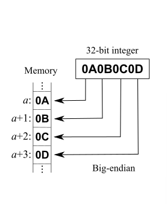
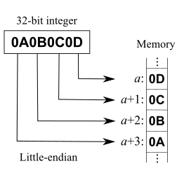

# Cpp 2024春季招聘面试笔记

This is the repository I use to keep track of spring 2024 recruiting (c++)

这是我用于记录2024春招(c++)的仓库


- [Cpp 2024春季招聘面试笔记](#cpp-2024春季招聘面试笔记)
    - [计算机基础](#计算机基础)
      - [原码 反码 补码](#原码-反码-补码)
      - [大端vs小端](#大端vs小端)
    - [C语言](#c语言)
      - [函数参数入栈顺序及i++,++i实现](#函数参数入栈顺序及ii实现)
    - [C++](#c)
    - [数据库](#数据库)
    - [系统编程](#系统编程)
    - [网络编程](#网络编程)

### 计算机基础

#### 原码 反码 补码
---

##### 原码

原码，符号位加真值的绝对值

```
+3[原] = 00000011
-3[原] = 10000011
```

##### 反码

正数的反码是其原码

负数的反码，符号位不变，其余各位`~`(取反)

```
+3[反] = 00000011[原] = 00000011[反]
-3[反] = 10000011[原] = 11111100[反]
```

##### 补码

正数的补码是其原码

负数的补码，是其反码+1

```
+3[补] = 00000011[原] = 00000011[反] = 00000011[补]
-3[补] = 00000011[原] = 11111100[反] = 11111101[补]
```

反码和补码，不能直接看出其实际的数值， 需要转换成原码后计算

数据在内存中均以补码形式存储，方便计算(做加法无需考虑符号)

#### 大端vs小端
---

##### 什么是字节序

字节顺序，又称端序或尾序（英语：Endianness），在计算机科学领域中，指电脑内存中或在数字通信链路中，组成多字节的字的字节的排列顺序。

在几乎所有的机器上，多字节对象都被存储为连续的字节序列。例如在C语言中，一个类型为int的变量x地址为0x100，那么其对应地址表达式&x的值为0x100。且x的四个字节将被存储在电脑内存的0x100, 0x101, 0x102, 0x103位置。[1]

字节的排列方式有两个通用规则。例如，将一个多位数的低位放在较小的地址处，高位放在较大的地址处，则称小端序；反之则称大端序。在网络应用中，字节序是一个必须被考虑的因素，因为不同机器类型可能采用不同标准的字节序，所以均按照网络标准转化。

例如假设上述变量x类型为int，位于地址0x100处，它的值为0x01234567，地址范围为0x100~0x103字节，其内部排列顺序依赖于机器的类型。大端法从首位开始将是：0x100: 0x01, 0x101: 0x23,..。而小端法将是：0x100: 0x67, 0x101: 0x45,..。

##### 大端序



低位高地址

##### 小端序



低位低地址

> tips: 为了保证传送顺序的一致性, 网际协议使用大端字节序来传送数据。

**参考**

[维基百科-字节序](https://zh.wikipedia.org/zh-cn/%E5%AD%97%E8%8A%82%E5%BA%8F)

### C语言

#### 函数参数入栈顺序及i++,++i实现
---

i++

```c
// i++
int j = i;
i = i + 1;
return j;
```

++i

```c
// ++i
i = i + 1;
return i;
```

```c
int i = 0;
printf("%d %d %d %d\n", ++i, i++, i++, ++i); // 4 2 1 4
```

### C++

### 数据库

### 系统编程

### 网络编程